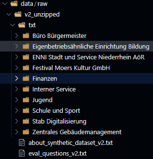

# Intranet Innovation: Empowering staff for enhanced citizen services

The [Project](https://n3xtcoder.org/intranet-innovation-empowering-staff-for-enhanced-citizen-services) is organised by the City of Moers and [N3XTCODER](https://n3xtcoder.org/).

## Description

As the administration of the City of Moers seeks to meet the evolving needs of its approximately 104,000 residents, the municipal intranet emerges as a pivotal platform for information dissemination and management. Improving the intranet is essential for enhancing the productivity and satisfaction of municipal employees, which in turn will lead to faster, more efficient, and effective services for the citizens of Moers. The challenge is to transform the municipal intranet into a more user-friendly, interactive, and intelligent platform that excels in understanding and generating answers, thereby improving the administration's knowledge base and search capabilities.

**GOAL:** Improve municipal intranet search experience
**Objective:** Optimise the intranet search capabilities, leading to faster and more precise information retrieval for increased productivity and enhanced value of the intranet as a central communication medium to optmize the performance and satisfaction of administrative staff.
**Metric:** Projected acceptance rate of search results.

### Impacted People

1. **780** Municipal Workers
2. **106241** citizens in the city of Moers
3. More than **800** sections published in the city intranet

## Environment Setup

```bash
# python version -> 3.10.13
python -V 

# create a environment named -> google-ai
python -m venv intranet-ai

# activate the environment
source intranet-ai/bin/activate

# create a Jupyter Notebook kernel
pip install jupyter
pip install ipykernel

# add your virtual environment as a kernel
python -m ipykernel install --user --name=intranet-ai --display-name="Py3.10-intranet-ai"

# verify kernel installation
jupyter kernelspec list

```

### Download Data

```bash

pip install gdown

# download the zip file from the google drive
gdown <Link to the zip file in the google drive >

# unzip Data
unzip v2-20240508T101819Z-001.zip
```

## Synthetic Data Generation Process

This section provides an overview of the data generation process, ensuring the creation of synthetic datasets that mimic original data while protecting sensitive information.

### Synthetic Dataset v2

- **Structure and Contents**:
  - The dataset includes TXT files with contents similar to the original dataset, ensuring sensitive data like city names and personal names are protected.
  - The TXT files maintain a structure akin to the original PDFs or DOCs that inspired the data synthesis.
  - The folder structure mirrors the original dataset, categorizing different topics to facilitate tracking of the generated files' subject matter.

- **Data Generation Prompts**:
  - **General Prompt**:

    ```markdown
    Analyse what the following text content is about and generate a new one covering the same general topic with FICTIONAL data 
    to PROTECT PRIVACY including FAKE NAME of locations, people, phone numbers, budget amounts, dates, among other sensitive 
    data that rather stays ANONYMOUS. Use ENGLISH OR GERMAN language for the new contents. The text must include title, author, issue date and effective date. Make sure contents has a similar length as the original.
    ```

  - **daenni01_dienstleistungsrahmenvertrag**:

    ```markdown
    Analyse what the following text content is about and generate a new one covering the same general topic with FICTIONAL data 
    to PROTECT PRIVACY. USE FAKE NAMES of locations, people, phone numbers, budget amounts, dates, among other sensitive 
    data that rather stays ANONYMOUS. Use ENGLISH OR GERMAN language for the new contents. The text must include title, author, issue date and effective date. Make sure contents has a similar length as the original.
    ```

  - **Enhanced Privacy Prompt**:

    ```markdown
    Analyse what the following text content is about and generate a new one covering the same general topic with FICTIONAL data 
    to PROTECT PRIVACY. USE FAKE NAMES of locations, people, phone numbers, budget amounts, dates, among other sensitive 
    data that rather stays ANONYMOUS. Use ENGLISH OR GERMAN language for the new contents. The text must include title, author, issue date and effective date. Make sure contents has a similar length as the original. DO NOT MENTION MOERS.
    ```

- **Data Quality and Model Analysis Evaluation**:
  - Questions to evaluate the quality of the data and the model's ability to analyze it are included.

- **Q/A Prompt**:
  - **Initial Prompt**:

    ```markdown
    Analyse the following files provided. Then, generate a complex question about the contents and then indicate 
    the user where the answer can be found and mention any relevant section or chapter. Assume the files are hosted 
    online, so please provide a reference link. DO NOT mention the name of the document in the question itself. 
    AVOID the word DOCUMENT in the question.
    ```

  - **Follow-up Prompt**:

    ```markdown
    Analyse again the two files provided. Then, generate a complex question about the contents and then indicate the 
    user where the answer can be found and mention any relevant section or chapter. Assume the files are hosted online, 
    so please provide a reference link. DO NOT mention the name of the document in the question itself. 
    AVOID the word DOCUMENT in the question.
    ```

## Data Understanding

### Quoting Jonathan from the N3XTCODER TEAM

`We have prepared a synthetic dataset based on real documents and structure from a municipal authority. This dataset is simplified to be text-only (no pdfs, docs) and emulates some of the folder structure of the real data. It also includes some evaluation questions within the file eval_questions_v2.txt.`

`Everything in this dataset is fiction, and it obviously has shortcomings with regards to proving that a solution will work on the real data. However we hope it will help in the design of your solutions. If a solution is promising, then further evaluation work using real data from our challenge partner, can be undertaken at the end of the programme.`

#### Data Directory Structure



The directory contains various department-specific documents provided in `text file format`, such as mayor's office, education, public services, cultural events, finance, internal services, youth, schools and sports, digitalization, and building management, along with information about synthetic dataset and some evaluation questions.

There are **10** departments with **44** documents in English(29) or German(15), as listed below:

| Department                                 | Total Documents | Language                |
|--------------------------------------------|-----------------|-------------------------|
| Büro Bürgermeister                         | 2               | English                 |
| Eigenbetriebsähnliche Einrichtung Bildung  | 9               | English (5), German (4) |
| ENNI Stadt und Service Niederrhein AöR     | 1               | German                  |
| Festival Moers Kultur GmbH                 | 1               | German                  |
| Finanzen                                   | 2               | English                 |
| Interner Service                           | 21              | English(13), German (8) |
| Jugend                                     | 1               | English                 |
| Schule und Sport                           | 1               | English                 |
| Stab Digitalisierung                       | 2               | English                 |
| Zentrales Gebäudemanagement                | 4               | English (3), German (1) |

`Eigenbetriebsähnliche Einrichtung Bildung` has **3** documents in German, namely:

- `bildung_1-01_-_da_ueber_die_einrichtung_einer_zahlstelle_im_gb_musik_der_eb_bildung`
- `bildung_4-02_-_da_ueber_die_einrichtung_einer_einnahmekasse_im_gb_bibliothek_der_eb_bildung`
- `bildung_04-03_-_da_zur_open_library`

- `bildung_3-01_-_da_ueber_die_einrichtung_einer_zahlstelle_und_von_einnahmekassen_im_gb_vhs_der_eb_bildung` contains a significant amount of text in both German and English, with the majority being in English.

`ENNI Stadt und Service Niederrhein AöR` has **1** document in German, namely:

- `daenni01_dienstleistungsrahmenvertrag`

`Festival Moers Kultur GmbH` has **1** document in German, namely:

- `dafestival-moers-kultur-gmbh`

1. `Interner Service` has **8** documents in German, namely:

- `da3.2-02_elektronische_zeiterfassung`
- `Da3.2-05_Personaldaten`
- `da3.2-06_bildschirmarbeitsplaetze`
- `Da3.2-08_Sponsoring (1)`
- `da3.2-18_gefahrstoffe`
- `da3.4-02_telekommunikationsanlage_hipath_4000`
- `da3.5-01_dezentrale_materialbeschaffung`
- `dv_03-21_zinsloses_darlehen_fahrrad`

`Zentrales Gebäudemanagement` has **1** document in German, namely:

- `dazgm-02_energievers`

Before Choosing an LLM to act on your data, you need to process the data and load it. The ingestion pipeline consists of three main stages:

1. Load the data
2. Transform the data
3. Index and store the data

### Loaders

We used data connectors, also called **Reader** in Llamaindex, specifically the `SimpleDirectoryReader`, which creates documents out of every file in a given directory to ingest the data from the `text files` provided to us and format the data into `Docment` objects. A `Document` is a collection of data(text) and metadata about that data.  

### Tranformations

After the data is loaded, you then need to process and transform your data before putting it into a storage system. These transformations include

- chunking
- extracting metadata
- embedding each chunk

This is necessary to make sure that the data can be retrieved, and used optimally by the LLM.

Transformation input/output are `Node` objects(a `Document` is a subclass of a `Node`).

WHich textsplitter and why?

### Indexing and Embedding

After loading the data, we have a list of Document objects (or a list of Nodes). It's time to build an `Index` over these objects so we can start querying them.

## Key Decisions

1. LLM - `gpt-3.5-tubro`
2. Vector Database - `Qdrant`

Under the hood, the Retrieval-Augmented Generation (RAG) application uses the following components:

- Embedding model: `jina-embeddings-v2-base-de` German-English bilingual embeddings model via [Jina.ai](https://jina.ai/embeddings#apiform)
- Vector database: [Qdrant](https://qdrant.tech/)
- Large Language Model (LLM): `gpt-3.5-turbo` via [OpenAI](https://platform.openai.com/docs/models/gpt-3-5-turbo)
- Orchestration framework: [LlamaIndex](https://www.llamaindex.ai/)
- App framework: [Streamlit](https://streamlit.io/)
